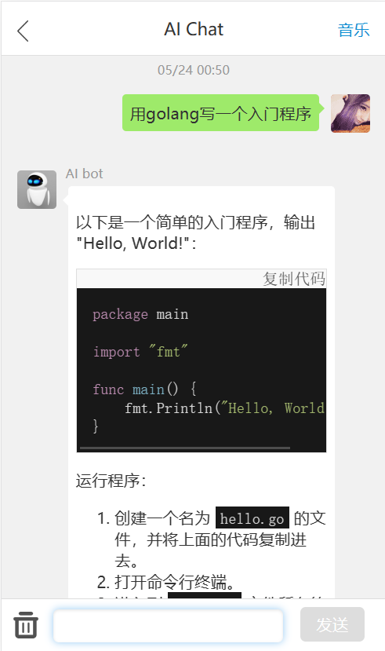

# aiChat

ChatGPT H5移动客户端，借助第三方API实现。

**apk下载地址：**  <https://wwgc.lanzouk.com/il0vi0xdqpfi> 密码:8080

## Feature

- 可打包为`apk` 或 `ipa`
- 支持`pwa`
- 支持代码高亮显示
- 支持`markdown`显示
- 支持多行文本域
- 支持保存聊天记录
- 未支持`Stream`流式输出
- 未支持关联上下文以减少`token`花费
- 足够简单，易于修改

## Preview

| screenshot1 | screenshot2 |
|:-|--|
|  |  |

## License

The [Apache-2.0](https://www.apache.org/licenses/LICENSE-2.0) License.
